##Ionic2-Meteor Login
This repository extends [ionic2-meteor-boilerplate](https://github.com/mjwheatley/ionic2-meteor-boilerplate) adding Meteor accounts, login and account management components, and Oauth services from Google and Facebook.

* Please refer to the base repository [README](https://github.com/mjwheatley/ionic2-meteor-boilerplate/blob/master/README.md) for additional documentation.

##Screenshots
###Login Components
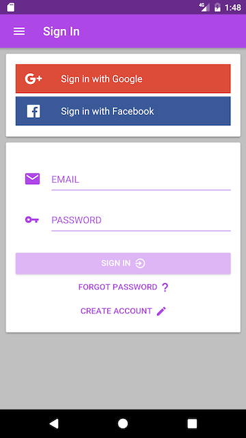 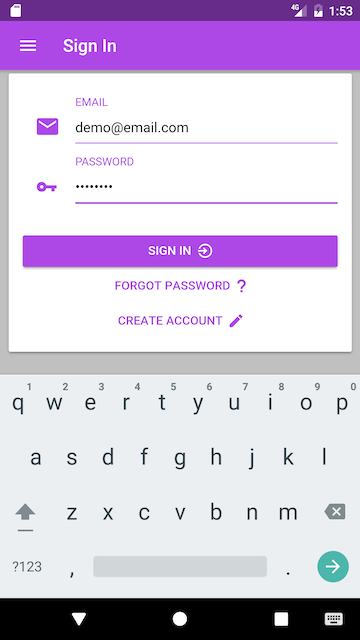 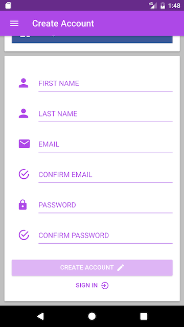 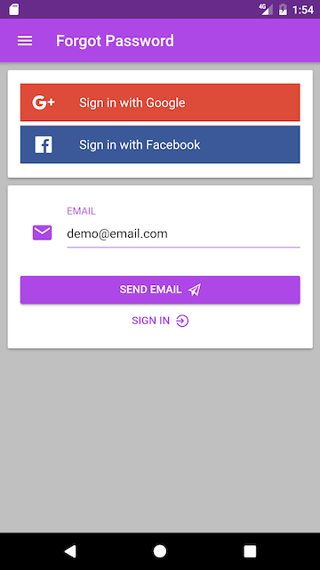 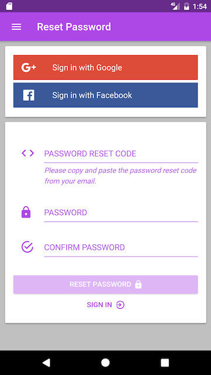
###Validation
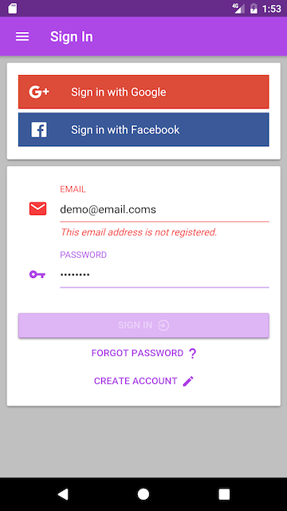 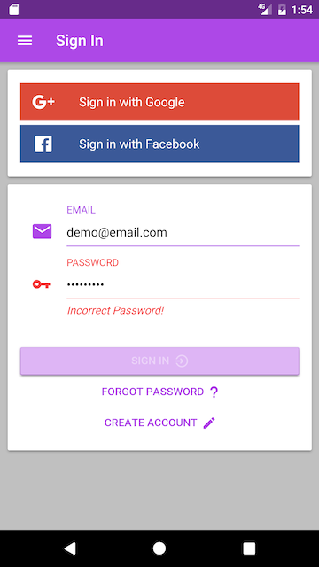 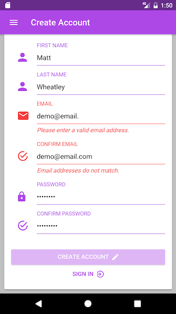 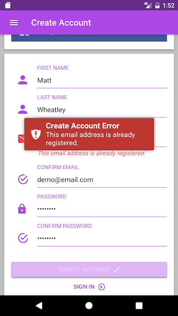 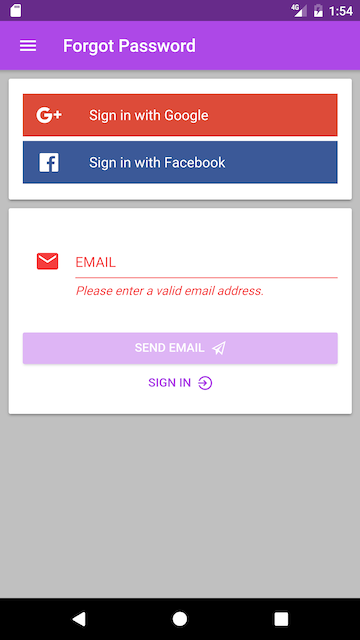
###Navigation Menu
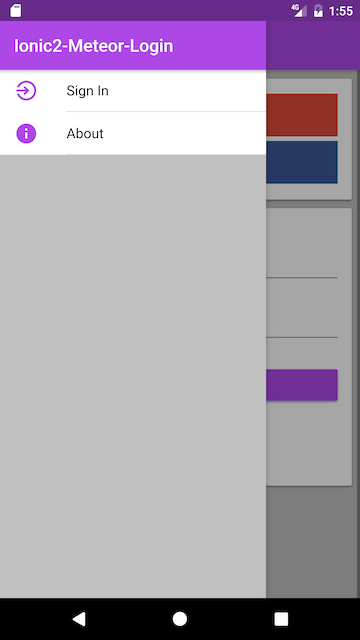 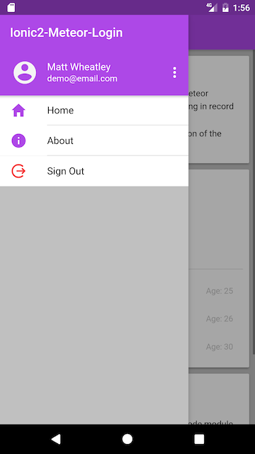 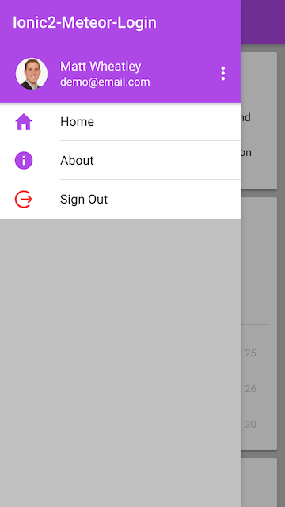
###Home Page
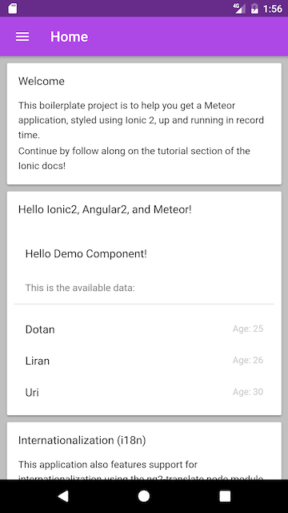  
###Account Management
 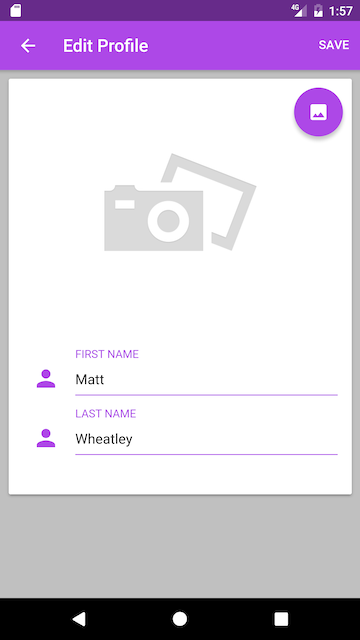  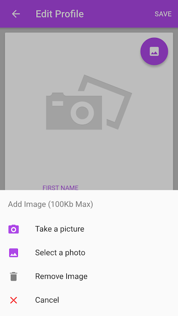  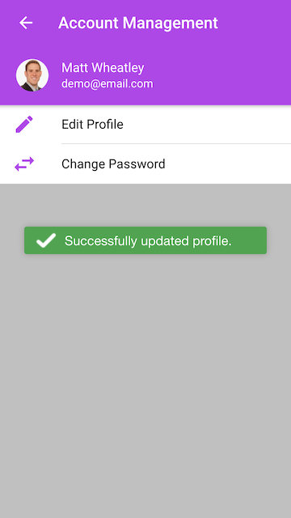 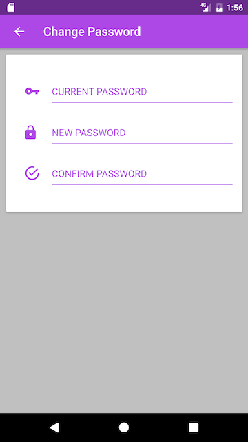

##What's New
* **Login Components**
    * ***LoginPage***
        * Container page for the different card components
    * ***LoginCardComponent***
        * Inputs for email and password
    * ***CreateAccountCardComponent***
        * Inputs for first and last name, email address, and password
    * ***ForgotPasswordCardComponent***
        * Input for email address to send password reset code.
    * ***PasswordResetCardComponent***
        * Inputs for password reset code and new password
    * ***OauthProviderComponent***
        * Buttons to open a pop-up for logging in using an Oauth provider
* **Navigation menu items**
    * Logged in
        * Sign In
            * ***LoginPage***
        * User Info - Account Management
            * ***AccountMenuPage***
    * Logged out
        * Sign Out
    * Global
        * About
            * ***AboutPage***
* **Account Management Components**
    * ***AccountMenuPage***
        * Navigation page for account management options
    * ***ChangePasswordPage***
        * Confirm current password and enter new password
    * ***EditProfilePage***
        * Change first and last name
        * Add/Edit/Remove image for user avatar
            * Supporting files
                * `app/client/imports/app/components`
                    * ***AddImageComponent***
                * Image resource
                    * `app/public/images/`
                        * ***add_image_camera_photo.png***
                * `app/client/imports/app/utils/`
                    * ***ImageHandler.ts***
                * `app/both/`
                    * ***FileUtil.ts***
* **Form validation and toast messages**
    * Supporting files
        * `app/client/utils/`
            * ***FormValidator.ts***
            * ***ValidationResultInterface.ts***
            * ***ToastMessenger.ts***
* **Stylesheets**
    * New `scss` files for styling form inputs and validation
* **METEOR_SETTINGS**
    * `config/development/settings.json`
        * New `private` fields for oauth credentials
* **Meteor packages**
    * ***Oauth Services***
        * service-configuration
        * accounts-facebook
        * accounts-google
    * ***Toast Messages***
        * chrismbeckett:toastr
    * ***Icons***
        * fortawesome:fontawesome
    * ***Adding Image***
        * mdg:camera
* **Cordova Plugins**
    * ***Adding Image***
        * cordova-plugin-camera@2.3.0
    * *Optional*
        *  cordova-plugin-device@1.1.3
        *  cordova-plugin-inappbrowser@1.5.0
        *  cordova-plugin-network-information@1.3.0

##Oauth Services
Refer to the developer guides for the different Oauth providers to set up and configure your app to use Oauth services and obtain the required credentials.
* ####Google
    * https://developers.google.com/identity/protocols/OAuth2
* ####Facebook
    * https://developers.facebook.com/docs/facebook-login

#####Development redirect urls
`http://localhost:3000/_oauth/google`
`http://localhost:3000/_oauth/facebook`

Once you have configured redirect urls, retrieve your credentials and add them to corresponding fields in `config/development/settings.json`.

You should then be able to run `npm start` and create an account using Oauth Services or using the app's registration form.

##Account Creation and Management
* Please refer to `app/client/imports/app/pages/account/login/oauth/oauth-provider.ts` to edit requested Oauth permissions.

* Please refer to `app/server/lib/accounts.js` for Oauth provider account creation and password reset email.

    * You can retrieve values for the requested permissions and save them to the user's profile.
    * You can edit the text of the email sent for password recovery.
