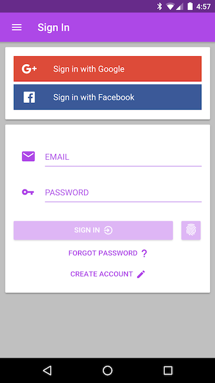
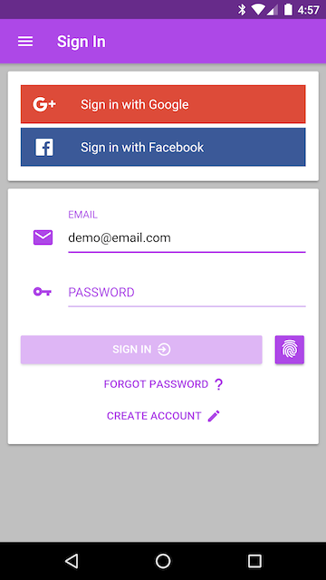
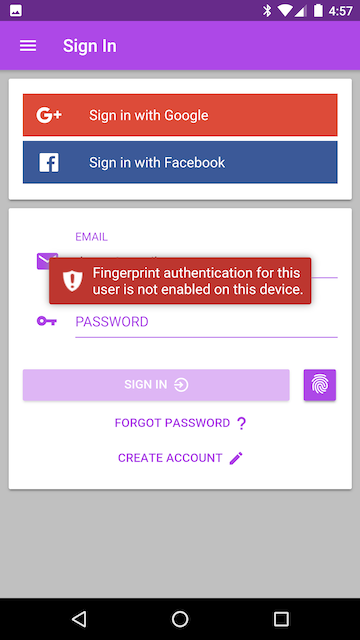
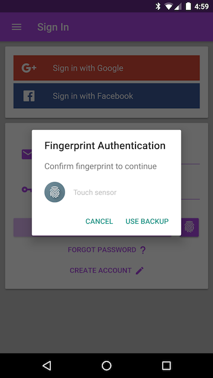
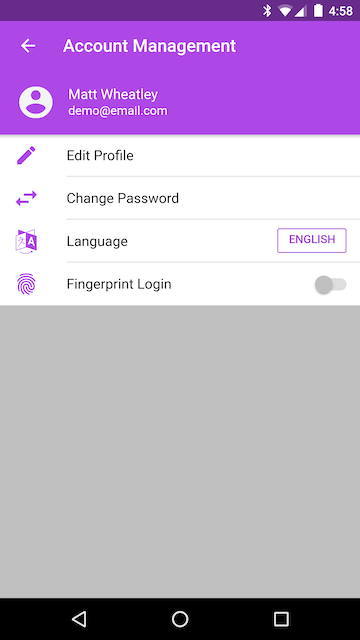
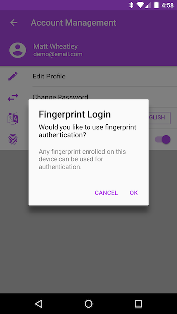
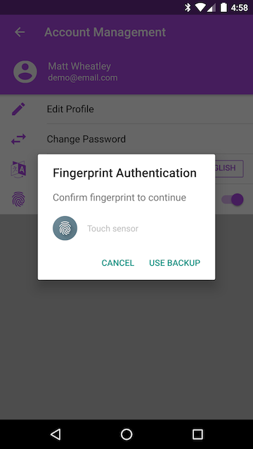
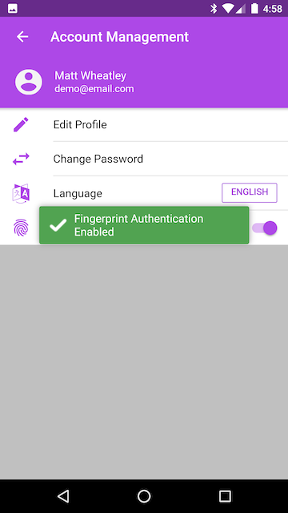

#Ionic2-Meteor Fingerprint Login
This repository extends [ionic2-meteor-login](https://github.com/mjwheatley/ionic2-meteor-login) adding the ability to login using mobile device hardware fingerprint sensors.

* Please refer to the base repository [README](https://github.com/mjwheatley/ionic2-meteor-boilerplate/blob/master/README.md) for additional documentation.

#Screenshots
##Android
###Login Page
   
###Account Management
   

##What's New
* ***Login Page***
    * Added fingerprint button next to login button
* **Account Management**
    * Added toggle to enable fingerprint authentication
* FingerprintHelper Utility
    * `app/client/imports/app/utils.fingerprinthelper.ts`
    * Utility file to consolidated function methods for the different platform fingerprint plugins
* **METEOR_SETTINGS**
    * `config/development/settings.json`
        * Added `public.fingerprint.appId`
* **Cordova Plugins**
    * Android
        * cordova-plugin-android-fingerprint-auth@1.2.4
    * iOS
        * cordova-plugin-touch-id@3.2.0
    * Both
        *  cordova-plugin-device@1.1.3
            * To obtain device UUID

##How To Use It
* Create an account / Login
* Open the menu and tap your user profile to navigate to account management
* Toggle "Fingerprint Login" to "ON"
* Hit "OK" on the disclaimer dialog
* Fingerprint authentication
* Sign out
* Enter email address
* Tap the fingerprint icon button
* Fingerprint authentication

#How It Works
* The user must login and enable fingerprint authentication from the account management menu.
* To enable fingerprint authentication, the user must successfully authenticate.

##Enabling Fingerprint Login
###Client Secret
* The server generates a client secret by encrypting the userId and device UUID.
* The server creates a fingerprint service on the user's profile, hashes the client secret, and stores the hashed client secret under the fingerprint service.
* The client secret is returned to the application to be used in the fingerprint authentication process.

###Authentication flow
* App checks for the availabilty of fingerprint authentication.
    * Checks if hardware is available
    * Checks if there are fingerprints enrolled on the device
* Gets client secret from the server
    * Sends device uuid to server
    * Server generates a client secret using the userId and deviceId
    * Server hashes the client secret and stores the hash like it would a password
    * Client secret is returned to the client
* Fingerprint authentication
    * **Android**
        * Upon successful authentication the plugin returns an encrypted token
    * **iOS**
        * Upon successful authentication the client secret is used as the token
* App sends the token and device UUID to the server to be saved under the user's profile.

##Fingerprint Login
* Enter email address
* Tap fingerprint icon button.
* The app sends the device UUID to the server and attempts to retrieve the token previously encrypted by the plugin.
    *  Server checks if the device UUID matches the one used when enabling fingerprint login. If validated, the token is returned.
* Fingerprint authentication
    * **Android**
        * The encrypted token is passed to the the fingerprint authentication plugin.
        * Upon successful fingerprint authentication the plugin decrypts the token and returns the client secret.
    * **iOS**
        * Upon successful fingerprint authentication the app uses the retrieved token as the decrypted client secret.
* The decrypted client secret is sent to the server for validation.
    * The server checks the client secret against the hashed client secret just like it would a password.
    * Upon validation, the server generates a time stamped login token and returns it to the application.
* The application logs in with the timestamped login token.